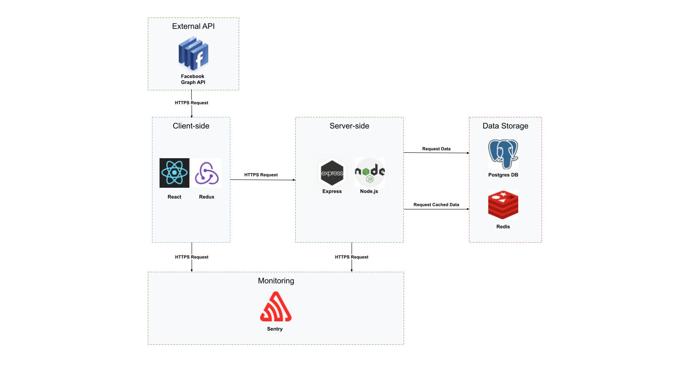

# inforum

## About Us
> *Harness the potential from the generation of tomorrow*

Inforum is a promotional content marketplace that aims to market to hard-to-reach millenials/Gen-Z demographics by utilizing network effects on social media platforms such as Facebook, Twitter, and Instagram. On our platform, our users can share offers to their social media for personal monetary benefit, and the banks are able to use our users to promote their offerings to our users’ network via a trusted source, creating a win-win situation for both parties. 

Create campaigns | Browse campaigns | Share campaigns | Track campaigns
:-------------------------:|:-------------------------: | :-------------------------: | :-------------------------:  
 |  |  | 

Table of Contents
---
- [Business Pitch](#business-pitch)
- [Inforum App](#app)
- [Architecture Diagram](#architecture-diagram)
- [Demo](#demo)
- [Product & Research](#product)
    - [Use Cases](./product_research/use_cases.md)
    - [Roadmap](./product_research/roadmap.md)
    - [Prototype (UI)](./product_research/prototype)
    - [User Research](./product_research/user_research)
- [Tech Stack](#tech-stack)
- [Decision Logs](#decision-logs)
- [Team](#team)
    - [Leader Selection](./team/leader_selection.md)
    - [Team Principles](./team/team_principles.md)
    - [Diversity](./team/diversity.md)

## Business Pitch
The problem | Market analysis | Financials | Business plan
:-------------------------:|:-------------------------: | :-------------------------: | :-------------------------:  
 |  |  | 

- Learn more about our pitch, market analysis, competitive landscape, customer value propositions, and financial modeling at [business plan](./business/).

## App
Download our app locally at [Inforum App](./app/)
      
## Architecture Diagram

## Demo 
https://github.com/leetim13/Inforum-content-marketplace/assets/20623399/ab045489-06d2-4793-ade3-6ed0f2959ce4
- Learn more at [Demo](./product_research/demo.md)

## Product

Product roadmap | Product decisions | User research/interviews
:-------------------------:|:-------------------------: | :-------------------------: 
 |  |  

- Learn more about our entire design process, including our product roadmap, use cases, user research, and UI/UX at [Product & Research](./product_research/).
  
## Tech Stack 
**Languages:** \
Javascript, SQL 

**Front End:** \
[React.js](https://reactjs.org/), [Redux](https://redux.js.org/) (State management), [Facebook Graph API](https://developers.facebook.com/docs/graph-api/)

**Back End:**  \
[Express.js](https://expressjs.com/), [Node.js](https://nodejs.org/en/)

**Data Storage:** \
[PostgreSQL](https://www.postgresql.org/) (ORM: Sequelize), [Redis](https://redis.io/) 

**Testing:** \
[Jest](https://jestjs.io/), 

**Exceptions Logging:** \
[Sentry](https://sentry.io/welcome/) 

**Deployment/CI:** \
[Heroku](https://www.heroku.com/), [Github Actions](https://github.com/features/actions) 

**Other Tools:** \
[Figma](https://www.figma.com/), [Postman](https://www.postman.com/), [Slack](https://slack.com/)

## Decision Logs
**Design and UI:** \
From a design perspective, we have decided to prototype our entire UI and high-level architecture using `Figma`, which is intuitive to use and requires not much technical background. Figma also has group sharing functionalities and will thus allow our CSC454 colleagues to  participate in the whole design process.

**React, Redux, Express, Node, ESLint, Jest:** \
We have decided to use this popular stack in web development, because it helps us build a web application from front-end to back-end only using `Javascript`. 
We also chose to use `Jest`, because both `Jest` and `React` are developed and supported by Facebook and will have better compatibility with one another.

**Data Storage (PostgreSQL/Redis):** \
We initially thought of using the popular `MERN` stack but eventually realized that a relational database (`postgreSQL`) would be more appropriate for our use case compared to a NoSQL database (`MongoDB`). As our application requires many different tables (`user`, `mission`, `post`, etc.), relational database will help us enforce data integrity and join tables more easily. 

We have also decided to add `Redis` to our tech stack as an in-memory key-value store for caching purposes, so we can retrieve data such as user-related data in a timely manner.

**Facebook Graph API:** \
We will use Facebook's `Graph API`, which will provide us with key statistics for each user's post (including the # of likes/comments). This will be used to calculate the points each user will get in our reward system.

**Monitoring (Sentry):** \
We have decided to use `Sentry` for error tracking and performance monitoring for both the front-end and back-end of our web application.

**Communication:** \
We have decided to use `Slack` as the primary source of all communication, including video calls and the recording of meeting notes. This is because we want to promote a professional work environment where the slack channel will only be used for work-related discussions.

**CI/CD/Version Control:** \
We have decided to use `Github` as our version control platform, because everyone on the team has professional experiences working with it and that it is free of charge for teams of any size unlike alternatives such as Azure DevOps.

We have decided to use `Github Actions` to set up our continuous integration workflow, including building, testing and deployment. This is because `GitHub` is arealdy used extensively for the entire application development process (commits, issues, branches, etc.).

We decided to use `Heroku` as our container-based cloud platform to deploy and manage our MVP mainly because it is free of charge and `Heroku` integrates with `Github` very well, so we could leverage that for continuous deployments.

## Team
Learn more about our team, including leader selection, team principles, and our values at [team](./team/).

