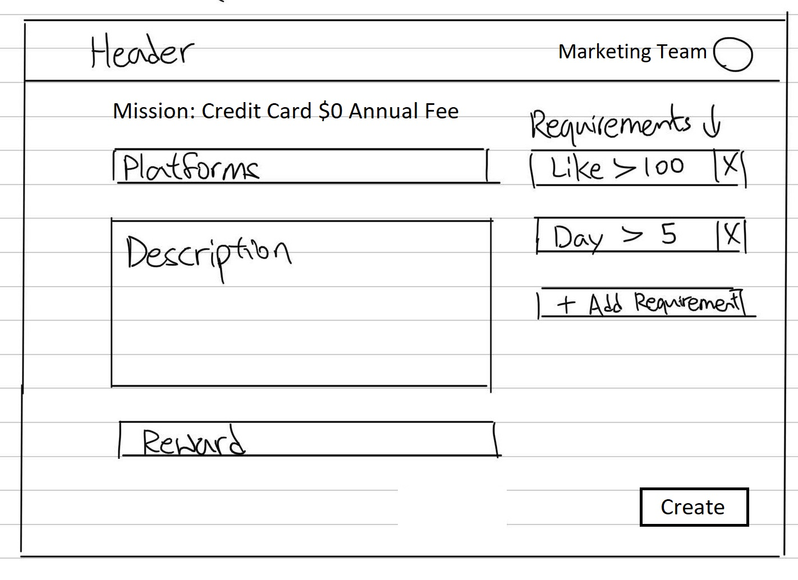
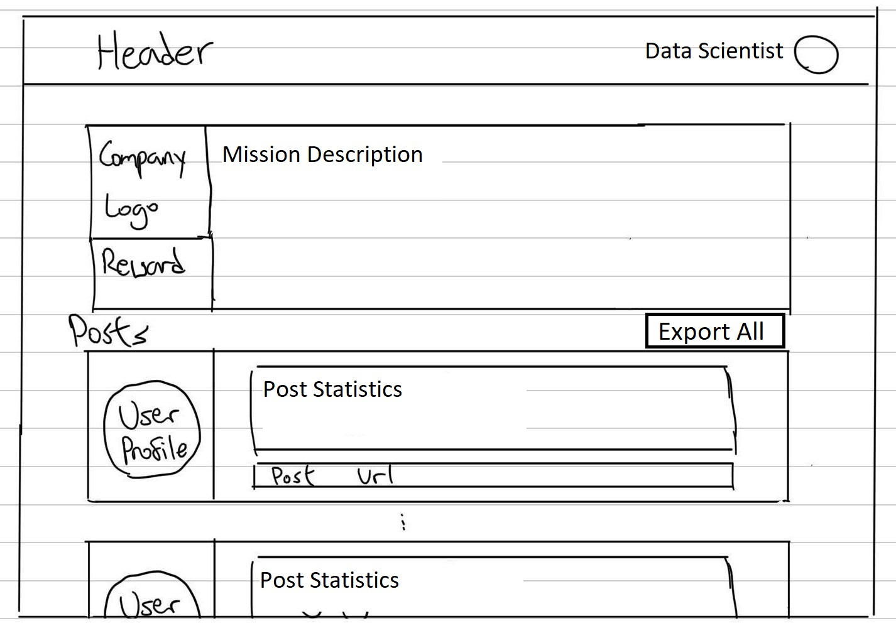
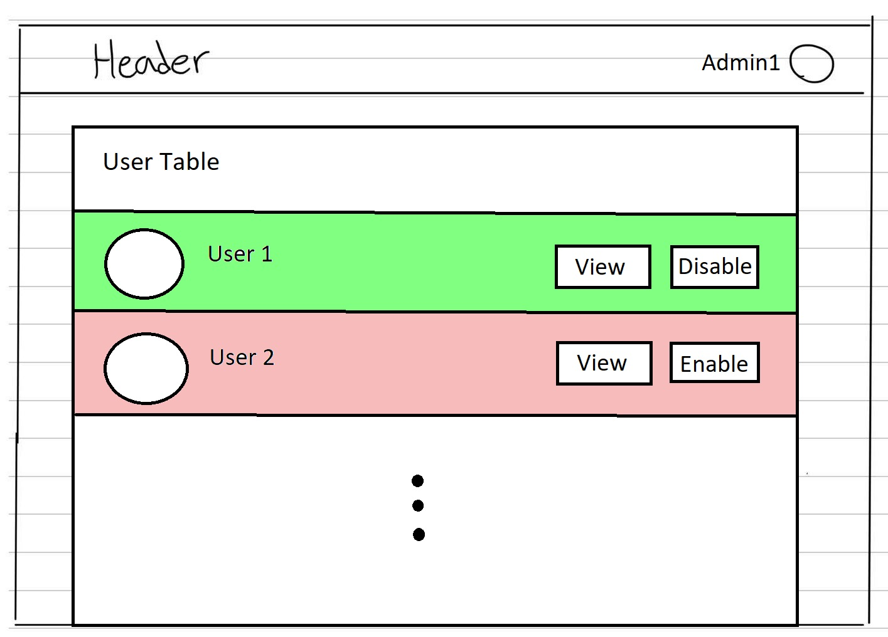

Use Cases
---

### Banks Marketing Team

Marketing teams from the banks will use our website to post marketing campaigns in the form of a “mission”. The missions could be in the form of sharing a new product or limited offers/deals, or simply posts/videos the banks want to advertise. 

### Banks Machine Learning Team & Data Scientists

Machine Learning teams or data scientists from the banks can view key statistics of each mission to have a better understanding of their marketing strategies and make further improvements. The banks will also have access to each post under their own mission in case they want to see it in detail.

### Promoters

Each promoter will use our website to view and accept new missions based on their preferences and the missions can also be queried via specific categories. After making a public post on social media, the promoters will then paste the post url (that will contain the unique post id) back on our website, so we can validate the post.

### Admin

Admin users have access to every page on the site, and data based on all the posts on the site.

