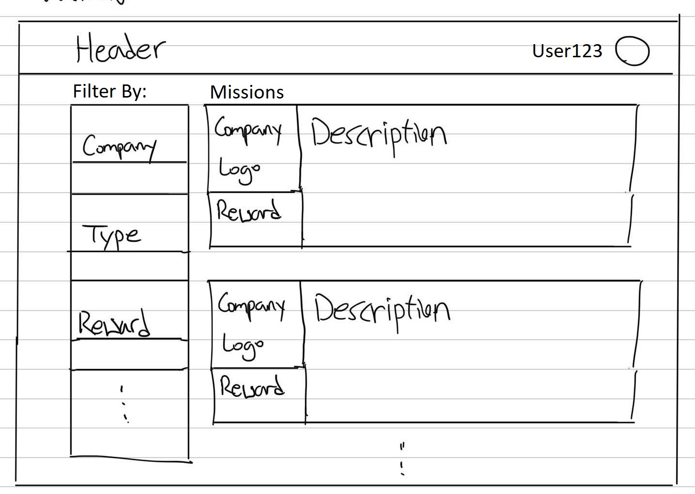

Each promoter will use our website to view and accept new missions based on their preferences and the missions can also be queried via specific categories. After making a public post on social media, the promoters will then paste the post url (that will contain the unique post id) back on our website, so we can validate it against the requirements.
